# Architecture Guide

This document explains the architecture of `vi_api_client` in technical terms
without assuming advanced architecture knowledge. For each central concept, it
answers three questions:

1. **What is it?**
2. **Why does this library need it?**
3. **What is the impact on usage and further development?**

It describes only the current state. The other documents in `docs/` provide
additional method and type reference material.

## 1. The library in one sentence

`vi_api_client` converts responses from the Viessmann Climate Solutions API
into structured Python models and provides the same domain workflows against
either the real API or bundled device fixtures.

The library is deliberately **not a persistent state store**. A `Device`
represents the state known when it was created. A consumer such as Home
Assistant decides when to refresh that state, how long to retain older values,
and how to present failures.

## 2. Technical overview

The architecture has three main parts:

- The **client core** implements discovery, parsing, refresh, and command
  workflows.
- The **models** represent consistent device state. An update creates a new
  `Device` instead of modifying an existing object.
- The **adapters** encapsulate external data access. The live adapter uses HTTP
  and OAuth; the fixture adapter uses local JSON data.

This separation ensures that domain rules are implemented once and behave the
same in live and offline operation.

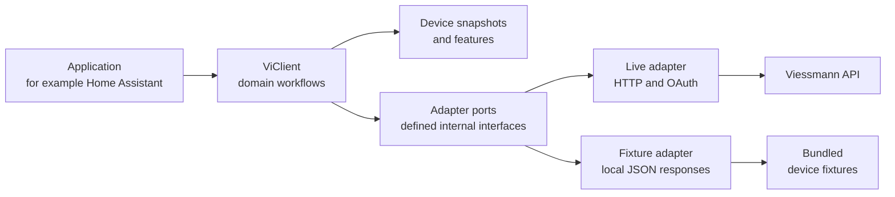

The application uses the same public client interface in both cases.
Differences in data access remain internal. This reduces consumer special cases
and enables shared contract tests.

## 3. Core concepts

### Snapshot

**What is it?** A snapshot is an immutable state object. A `Device` contains
the metadata and features known when the object was created.

**Why?** In-place mutation could let different parts of a consumer observe
different states while an update is running. A new object makes the state
transition explicit.

**Impact:** A consumer must adopt the returned snapshot to use the new state.
An older `Device` reference remains unchanged and does not become current
automatically.

A snapshot does not state how fresh its data is. An empty feature collection
can mean that features have not been loaded or that the API returned no
features. Hydration is therefore an operation, not an unambiguously observable
model state.

### Feature

**What is it?** A `Feature` is one flat device property addressed by its full
name, for example:

```text
heating.sensors.temperature.outside
heating.circuits.0.heating.curve.slope
```

It contains its value, unit, and information such as whether it is enabled and
ready.

**Why?** The API supports many device types and returns deeply nested data. Full
feature names provide uniform access without a separate Python class hierarchy
for every device type.

**Impact:** Consumers retrieve features with `device.get_feature(name)`. New
API features can often be used without adding a dedicated client method.

### Writable feature and `FeatureControl`

**What is it?** A writable feature has `FeatureControl` metadata describing:

- the API command,
- the parameter associated with this feature,
- additional required parameters,
- allowed ranges or option values, and
- the command URI.

`FeatureControl` describes a possible command; it does not execute it.

**Why?** Command rules come from API responses and vary by device and feature.
Keeping them in the model allows the shared core to validate and construct
commands generically.

**Impact:** Writability means more than having a value. Status, parameters,
companion values, and constraints must be validated before sending a command.

### Seam

**What is it?** A seam is a defined boundary at which one implementation can be
replaced by another without changing the domain logic above it.
`_DiscoveryAdapter` and `_CommandAdapter` form the main seam in this library.

**Why?** HTTP access and local fixtures are two real execution paths. Both must
use the same discovery, parsing, refresh, and command rules.

**Impact:** The seam remains private and adds no public complexity. Live and
fixture behavior can be tested against the same contract. This seam is
justified by two existing implementations; it is not a general requirement to
add a seam around every function.

### Port and adapter

**What is it?**

- A **port** defines operations the core requires from its environment. Private
  Python `Protocol` types express these requirements.
- An **adapter** implements those operations for a specific environment.

**Why?** HTTP, OAuth, and file access are infrastructure concerns. Parsing and
command rules are domain logic. Separating them prevents infrastructure details
from duplicating or influencing domain workflows.

**Impact:** HTTP changes remain in the live adapter. Domain-rule changes belong
in the core and apply automatically to both adapters.

### Deep module

**What is it?** “Deep” describes the ratio between an interface and the
functionality it encapsulates. A deep module exposes a few clear operations and
implements several cohesive rules behind them. It does not mean deeply nested
directories or unnecessarily complicated code.

`CredentialDocument` is an example:

```text
small interface:     read()  |  update(...)
                              ↓
encapsulated rules:  validate JSON
                     preserve existing fields
                     retain corrupted files
                     use a temporary sibling file
                     replace atomically
                     set secure permissions
```

**Why?** Otherwise CLI and OAuth would each implement the same persistence
rules, creating duplication and potentially inconsistent behavior.

**Impact:** CLI and OAuth use only `read()` and `update(...)`. Validation,
merging, permissions, and atomic replacement have one owner. A small interface
therefore encapsulates a substantially larger cohesive responsibility.

### Additional workflow terms

- A **consumer** is an application or library using `vi_api_client`, such as
  `vi_climate_devices`, Home Assistant, or the CLI. Cache, polling, UI state,
  and retry policy belong to that caller.
- The **client core** is the shared implementation in `ViClient`. It
  coordinates domain workflows and enforces invariants without knowing HTTP,
  OAuth, or fixture paths.
- **Discovery** determines installations, gateways, and devices. Discovering a
  device does not establish that its feature values are current.
- **Parsing** validates and converts external JSON into internal models. A
  successful HTTP status alone does not guarantee a valid response structure.
- **Hydration** loads features for an already known device.
- **Refresh** loads a device's features again and creates a new `Device`.
- A **command** is a write operation. Command success confirms acceptance, not
  that the effective state has already been read back.

## 4. System context and responsibilities

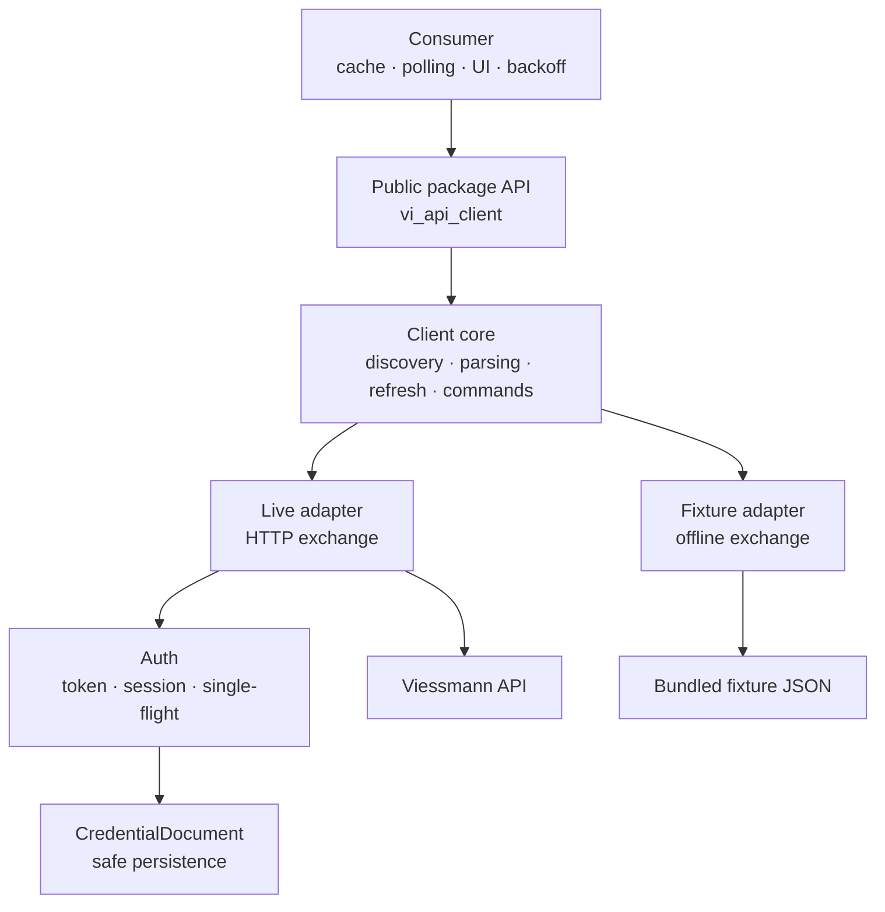

The library owns response conversion and validation, feature-command rules,
adapters, one `OAuth` instance's token state, credential persistence, and the
exception hierarchy.

The consumer owns snapshot lifetime, polling, refresh timing, request
concurrency, retry and backoff, `retry_after`, availability, stale values, and
optimistic UI state.

This boundary prevents conflicting policies. The library does not know a
consumer's update strategy. Automatic sleeps, retries, or caching could conflict
with Home Assistant's coordinator or another consumer's lifecycle.

## 5. Module map

| Module | Responsibility | Deliberately not responsible for |
| --- | --- | --- |
| `__init__.py` | Curated public imports | Internal adapters and helpers |
| `api.py` | Shared domain client workflows | HTTP details and fixture paths |
| `_adapter.py` | Ports, live adapter, HTTP error mapping | Building domain models |
| `mock_client.py` | Fixture adapters and `MockViClient` | Alternative domain logic |
| `parsing.py` | Convert nested API features into flat features | Network and consumer state |
| `models.py` | Immutable snapshots and command metadata | Polling and persistence |
| `auth.py` | Authenticated requests, OAuth, session lifecycle | General retries |
| `credentials.py` | Read, merge, safely replace credentials | OAuth decisions |
| `exceptions.py` | Public exceptions | UI error presentation |
| `cli.py` | Command-line orchestration | A second client implementation |
| `utils.py` | Formatting and privacy helpers | Domain workflows |

`ViClient` contains shared rules. Adapters retrieve or send raw data; they do
not make domain decisions. This applies the single-responsibility principle at
module level: a transport change should affect `_adapter.py`, while a model
invariant should remain independent of transport.

## 6. Domain model and immutability


An `Installation` describes an installation. A `Gateway` connects it to
devices. A `Device` contains features and rejects duplicate feature names.

`Device.features` is stored as a tuple. `get_feature(name)` uses a read-only
lookup. The collection and lookup therefore cannot diverge.

Immutability is deliberately **not recursive**. An arbitrary `Feature.value`
is not deep-copied or converted into a custom immutable JSON type. The model
protects the containers and mappings it owns.

New snapshots make state transitions explicit:

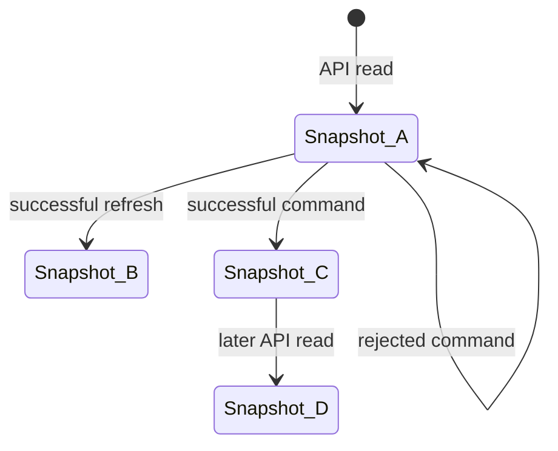

- A **refreshed snapshot** contains values from an API read.
- A **command-updated snapshot** applies the requested value locally after
  command success but before read-back.
- A later read returns authoritative API state.

The consumer explicitly decides when to replace its stored snapshot.

## 7. From nested JSON to flat features

The parser converts nested API structures into flat, fully named features:

```text
API feature: heating.circuits.0.heating.curve
Properties:  slope = 1.2, shift = 0

Result:
  heating.circuits.0.heating.curve.slope
  heating.circuits.0.heating.curve.shift
```

This avoids device-specific class hierarchies and lets many new API features
work without new Python methods.

The parser also associates command metadata with the correct feature. Only a
parameter explicitly marked `required: false` is optional. If the flag is
absent, the parameter is treated as required to avoid incomplete commands.
Complex structures such as schedules remain one value when further splitting
would lose their meaning.

## 8. Read workflow

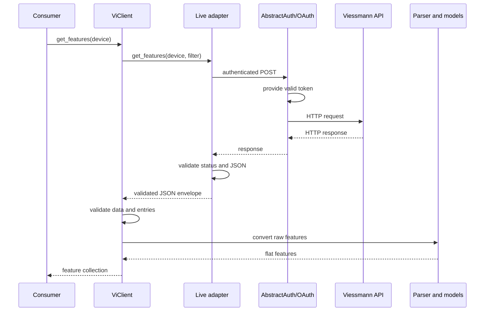

The adapter validates transport status and basic JSON. The core validates the
domain envelope. The parser constructs models. This assigns each failure to the
boundary that can describe it correctly.

Discovery proceeds through installations, gateways, devices, and features.
`get_devices(..., include_features=True)` combines discovery and hydration;
`get_full_installation_status()` traverses the hierarchy. These workflows are
currently conservative and sequential, but exact ordering is not a public
compatibility contract.

`{"data": []}` is a valid empty result. Non-JSON content, a wrong root type,
missing or non-list `data`, or non-object entries raise `ViResponseError`.
This prevents a provider contract failure from appearing as an empty account.

## 9. Device refresh

`update_device(device)` reads one device's features and returns a new refreshed
snapshot. The input remains unchanged.

`update_gateway_devices(devices)` refreshes known devices on one gateway,
normally with one bulk request:

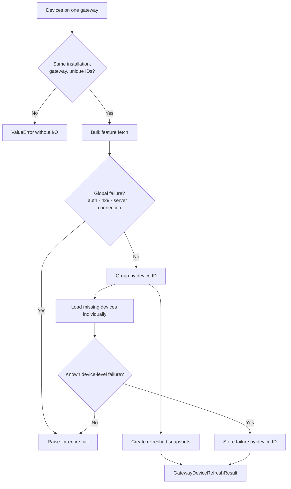

`updated_devices` contains successful snapshots;
`errors_by_device_id` contains known device-specific failures. Consumers can
adopt successful devices while marking only affected devices unavailable.
Authentication, rate-limit, server, and connection failures remain global.

The bulk path reduces request count without starting one request per device.

## 10. Writing one feature value

`set_feature()` is the safe path for ordinary single-value changes.

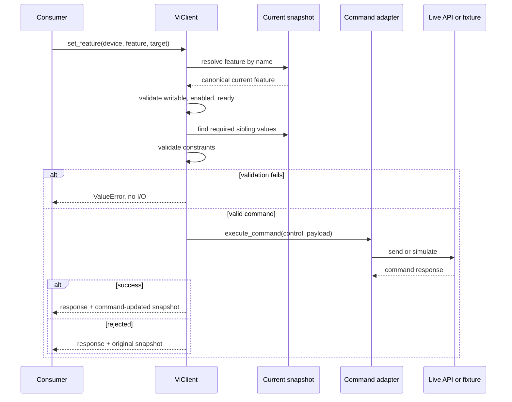

The supplied `Feature` acts as a name reference. The client resolves that name
from the current `Device` to avoid combining stale command metadata with newer
device state.

A command may require companion values:

```text
requested: slope = 1.4
current required value: shift = 0
payload: {"slope": 1.4, "shift": 0}
```

Required sibling features must exist, be enabled and ready, and have a value
other than `None`. `False`, `0`, and an empty string are valid values.
Optional siblings are not added automatically.

Before I/O, the core checks options, ranges, steps, string lengths, and regular
expressions. Invalid local input raises without sending a request.

Command success is not read-back. The returned snapshot applies the requested
value locally; a later refresh may confirm or replace it. Optimistic UI state,
which may be displayed before command completion, belongs entirely to the
consumer.

## 11. Explicit multi-parameter commands

`execute_command(feature, parameters)` is the lower-level path for a consumer
that already knows the complete payload. It validates feature state and required
parameters, adds nothing, does not mutate the payload, permits additional
explicit parameters, and does not update a `Device`.

```python
response = await client.execute_command(
    slope_feature,
    {"slope": 1.4, "shift": 0},
)
```

It complements rather than replaces `set_feature()`. Without a `Device`,
the client cannot derive sibling values or return updated device state.

## 12. Live and fixture-backed clients

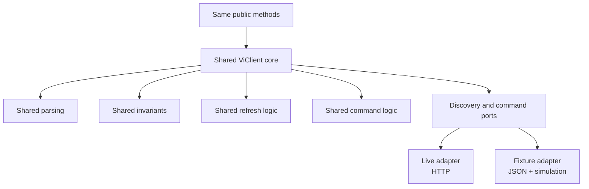

`ViClient(auth)` uses `_LiveAdapter`, which builds URLs, performs
authenticated requests, and validates transport responses.

`MockViClient(device_name)` uses fixture adapters and needs no authentication,
network, or session. Fixtures in `src/vi_api_client/fixtures/` are bundled
product data representing real or realistic complete device responses.

The fixture command adapter simulates success. Shared core logic creates the
same command-updated snapshot as the live path; fixture files are not modified.

Two complete client implementations would allow discovery, parsing, refresh,
and command behavior to diverge. The adapter seam limits differences to external
access.

## 13. Authentication and session ownership

`AbstractAuth` defines three requirements: provide a valid token, perform an
authenticated request, and close owned resources. This lets consumers such as
Home Assistant supply their own OAuth implementation and session.

An external session is injected at construction:

```python
auth = OAuth(
    client_id="...",
    redirect_uri="...",
    token_file="tokens.json",
    websession=session,
)
```

`auth.websession` is readable but cannot be replaced. Ownership is therefore
stable:

| Session source | Responsible for closing |
| --- | --- |
| Supplied with `websession=` | Consumer |
| Created on demand by auth | Auth |

Normal requests must finish before `async_close()`; auth does not perform
general request counting.

Standalone `OAuth` implements Authorization Code with PKCE. It creates a
verifier and challenge, exchanges the authorized code for tokens, persists
tokens, and refreshes them when necessary. PKCE protects the code exchange
without embedding a client secret.

### Single-flight refresh

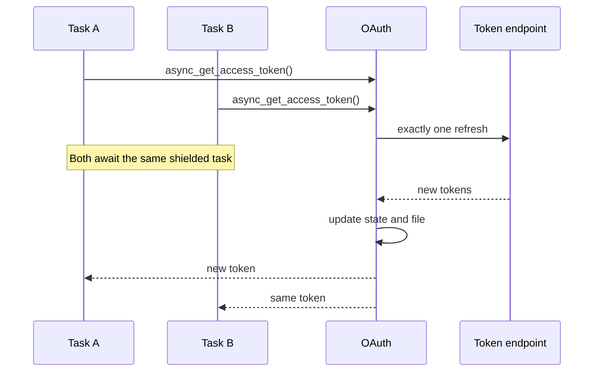

One waiting caller's cancellation does not cancel the shared refresh. All other
waiters receive the same result or failure, a later call may retry, and close
allows an active refresh to finish. This guarantee applies to one `OAuth`
instance in one event loop, not across instances, threads, or processes.

## 14. Credential document

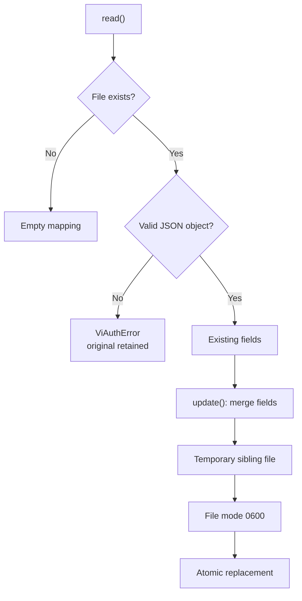

`CredentialDocument` is the single owner of the shared OAuth and CLI JSON
file. A missing file is empty; corrupted JSON raises and remains intact.
Updates preserve unknown fields, write a temporary sibling, set mode `0600`,
and use `os.replace()`.

Atomic replacement ensures readers see either the complete old or complete new
file, never a partial write. It does not coordinate in-memory tokens across
processes.

## 15. Exception architecture

Expected provider and transport failures inherit from `ViError`.

| Situation | Exception | Consumer meaning |
| --- | --- | --- |
| Network, timeout, DNS | `ViConnectionError` | Request was not completed |
| HTTP 401 or 403 | `ViAuthError` | Authentication or authorization failed |
| HTTP 404 | `ViNotFoundError` | Resource does not exist |
| HTTP 429 | `ViRateLimitError` | Rate limit; `retry_after` may exist |
| HTTP 400 or 422 | `ViValidationError` | Provider rejected input |
| HTTP 5xx | `ViServerInternalError` | Provider failure |
| HTTP 2xx, invalid body | `ViResponseError` | Response violates the contract |
| Invalid local usage | `ValueError` | Detected before I/O |

The library does not retry reads or commands automatically. After a connection
failure it may be unknown whether a command executed; automatic repetition
could execute it twice. Consumers decide retry and backoff, using
`ViRateLimitError.retry_after` when available.

A transported command may still be rejected at domain level and return
`CommandResponse(success=False)`. `set_feature()` then returns the original
snapshot.

## 16. Concurrency ownership

The library is asynchronous but does not own global concurrency policy:

- consumers may start independent operations as tasks,
- consumers choose semaphores or serialization,
- composed workflows do not create broad automatic concurrency,
- gateway bulk refresh reduces request count, and
- token refresh is coalesced only within one standalone `OAuth` instance.

For Home Assistant, the coordinator typically owns polling and cache, a
consumer lock may serialize writes and refreshes, and Home Assistant's OAuth
session may manage tokens. This permits each consumer to implement its own
scheduling, availability, and rate-limit policy.

## 17. Public and internal API

Consumers import public symbols from the package root:

```python
from vi_api_client import Device, Feature, MockViClient, OAuth, ViClient
```

The package root is `vi_api_client/__init__.py`. It is the curated public
surface and includes clients, auth types, models, results, the exception
hierarchy, external OAuth constants, and `format_feature`.

Private adapters, parsers, credential persistence, endpoints, and CLI helpers
are not consumer contracts. A leading underscore reinforces this intent.
`mask_pii` remains a direct utility import rather than a package-root export.

This boundary lets internal structure evolve without making every module path a
compatibility promise.

## 18. CLI architecture

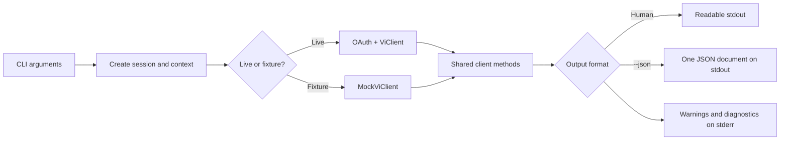

TLS verification is enabled by default. `--insecure` is explicit and warns.
With `--json`, standard output remains machine-readable while diagnostics use
standard error. Reusing client methods prevents alternative CLI-specific domain
behavior.

## 19. Fixtures and tests

`src/vi_api_client/fixtures/` contains complete device responses for the
public `MockViClient`. They are bundled product assets and represent real or
realistic anonymized devices.

`tests/fixtures/` contains smaller scenario-specific inputs. They should derive
from realistic responses when possible, but may model errors and edge cases
that no complete device fixture contains.

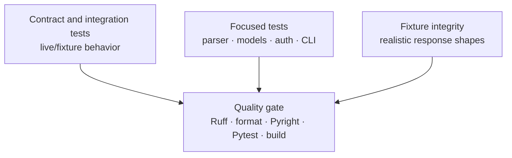

HTTP and OAuth tests use controlled responses. Offline workflows exercise the
public API. Model, contract, public-API, and build tests protect invariants and
ensure product fixtures are shipped.

## 20. Why this is not over-engineered

Each additional private component addresses an existing requirement:

- two real data sources justify the adapter seam,
- immutable snapshots prevent inconsistent consumer state,
- one command path prevents different write rules,
- one credential module prevents conflicting persistence rules, and
- single-flight prevents a concrete OAuth race condition.

The library deliberately has no dependency-injection framework, repository
layer, event bus, cache, general retry engine, device-specific service classes,
universal JSON-schema framework, or cross-process OAuth locks.

The design rule is to centralize a rule when multiple existing workflows depend
on it. No framework is introduced solely for hypothetical future requirements.

## 21. Locating future changes

- **New public operation:** define its contract on `ViClient`, add only the
  necessary private port operation, implement both adapters, validate in the
  core, and add contract tests.
- **New parsing rule:** start from a real response shape, implement centrally in
  `parsing.py`, and test normal and edge cases.
- **New command rule:** place shared validity rules in the core; adapters only
  exchange data.
- **New HTTP mapping:** interpret status and headers at the live-adapter
  boundary; keep retry decisions with consumers.
- **New device fixture:** add a complete anonymized product fixture and test its
  integrity and at least one public workflow.

The reason for a change determines its module, rather than call order or
implementation convenience.

## 22. Common misconceptions

- **“Frozen means every nested value is immutable.”** No. Models protect their
  own containers; arbitrary complex `Feature.value` data is not recursively
  frozen.
- **“`set_feature()` reads the value back.”** No. It returns a locally
  command-updated snapshot. A later read returns refreshed state.
- **“`MockViClient` has simplified domain logic.”** No. It replaces only
  environment adapters.
- **“Async means everything runs concurrently.”** No. Consumers decide domain
  concurrency.
- **“The library waits after HTTP 429.”** No. It provides the exception and
  possibly `retry_after`; consumers own backoff.
- **“Atomic writes prevent process conflicts.”** No. They prevent partial files,
  not conflicts among independent OAuth instances.
- **“A seam is always public API.”** No. The main adapter seam is private.

## 23. Consumer checklist

1. Create an external `aiohttp.ClientSession`, or use auth as a context manager.
2. Create `OAuth` and `ViClient`.
3. Discover installations, gateways, and devices.
4. Load snapshots and retain them in the consumer's cache.
5. Resolve features from the current snapshot with `get_feature(name)`.
6. Use `set_feature()` for ordinary writes and adopt its returned snapshot.
7. Read again later when authoritative values are required.
8. Own polling, availability, concurrency, retry, and backoff.
9. Use the same workflow with `MockViClient(device_name)` offline.

```text
The consumer owns time and retained state.
ViClient owns domain workflows.
Adapters own exchange with external environments.
Auth owns its token and session lifecycle.
Models represent immutable state.
```

## 24. Further documentation

- [Getting Started](01_getting_started.md)
- [API Structure & Concepts](02_api_structure.md)
- [Authentication & Connection](03_auth_reference.md)
- [Models Reference](04_models_reference.md)
- [Client Reference](05_client_reference.md)
- [CLI Reference](06_cli_reference.md)
- [Exceptions Reference](07_exceptions_reference.md)
- [ADR 0001: Gateway-scoped device refresh](adr/0001-use-gateway-scoped-device-refresh.md)
- [ADR 0002: Request policy belongs to consumers](adr/0002-keep-request-policy-with-consumers.md)
- [Canonical domain language](../CONTEXT.md)
